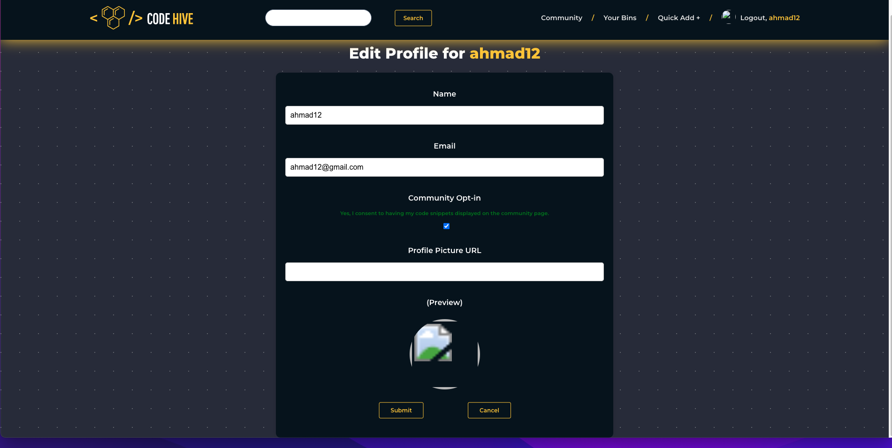

# Code Hive

## Project By

Jonathan Thomas

- Github: https://github.com/JuanitoDeLaTorre
- LinkedIn: https://www.linkedin.com/in/john-steed-thomas/

Ahmad Ismael

- Github: https://github.com/ahmadkismael
- LinkedIn : https://www.linkedin.com/in/ahmad-ismael-601162244/

## Introduction

Our project provides a unique solution for managing code snippets by allowing users to categorize and access them with ease. Instead of storing snippets on their personal computers, which can be hard to locate, our platform offers an intuitive search feature that helps users find the snippets they need. Additionally, users can browse through snippets uploaded by other users, sorted by category, and copy them to their own categories if they find them helpful.

To promote collaboration and knowledge sharing, we have included a community page that highlights the most active users on the platform, providing users with an idea of what other people find useful. Our navigation bar features a quick logout button, a shortcut to add new snippets quickly, a link to personal bins, and a link to the community page.

## Technology and UI

We have built our platform using the MERN stack, ensuring a seamless user experience with a modern and responsive interface. In addition to the core features, we have included an "Edit Profile" button in the navigation bar, which makes it simple for users to update their profile information. Users can also view their personal information in a card format within their bins, making it easy to keep track of their account details.

To enhance the user experience, we have incorporated various animations into our website. These animations are designed to create a more engaging and enjoyable experience for users, while also making the platform visually appealing. Our focus on design and user experience guarantees that users can navigate the platform with ease and find it a pleasure to use.

## Challenges

We chose this project because we wanted to tackle a challenging task that would test our skills and knowledge. Instead of choosing a generic idea for this project, we decided to a product that would be actually useful for developers like us. This project presented us with a unique set of challenges that we had to overcome. One of the biggest challenges we faced was building the search bar, which involved retrieving data from the backend and displaying it in a specific way on the front end. We also had to create a result page that would show similar results to the user's search query, for user profiles, categories, and code snippets.

Another significant challenge was testing the routes and ensuring that the data was being sent correctly to the front end. We had to work on creating the necessary functionality for our buttons, ensuring that they worked as intended. Additionally, we faced some difficulties with authentication, specifically ensuring that users who edit their profiles can still log in after logging out.

Despite the challenges, we were able to overcome them through hard work and perseverance, resulting in a platform that we are proud of. Our team worked collaboratively to find innovative solutions to these challenges, and we believe that this experience has helped us grow and develop as developers.

## User Stories

1. AAU, I want to be able to create a new account using basic login info (username, email, password, profile picture)
2. AAU, I want to be able to create a category of code snippets for future use (e.x. Python algorithms, Data Structure Algorithms, helper functions, etc.)
3. AAU, I want to be able to edit category name
4. AAU, I want to be able to add code snippets to each category with the following attributes
   a. Name of snippet
   b. category
   c. Body of snippet
   d. description
5. AAU, I want to be able to edit my existing code snippets
6. AAU, I want to be able to delete my existing code snippets
7. AAU, I want to see other user’s categories and code snippets through the community section
8. AAU, I want the option to hide my snippets from other users on the site
9. AAU, I want my token to persist through refreshes
10. AAU, I want to be able to search for user, categories and snippets
11. AAU, I want to be able to edit my profile
12. AAU, I want to be able to log out

## Screen Shots

Home page

Community page

Result page

Bins page

Add snippet page

Edit profile page

## How to use the website?

1. If you don't have an account, use the sign up button in the top right. Onlogged in users have the ability to browse the users in the community section, but now view any specific snippets.

2. Once you have an account or you are logged in you can you can view your profile page and edit it if wanted from a link in the navbar.

3. Then you can procced by creating a category (bin) and adding the desired snippets to it that you think would be helpful for you in the long term.

4. You can also click on the community link in the nav and that will show you other users and how many snippets they have and the user's most popular bin (decided by number of snippets). You can also view their snippets and if you decide its useful for you, you can copy it to your snippet collection via a form that expands on the snippet page.

5. You can also search for a specific user or categories and even snippets and if you're not sure what you are searching for the result page will show similar users, categories and snippets to help the user.

## Technologies Used

1. Express.js for managing the back-end server
2. MongoDB for the data base
3. Mongoose object validation and creation
4. React for the front-end
5. Jsonwebtoken for User authentication
6. Node.js for server side development and package managment
7. Javascript
8. HTML
9. CSS
10. Full CRUD functionality for Users,Categories and Snippets
11. React Router
12. Highlight.js for code highlighting

## Attributions

- Hive logo: Riskywas on Flaticon
- Hive logo main page: Deylotus Creative Design on Flaticon
- Loading animations for Loading.io
